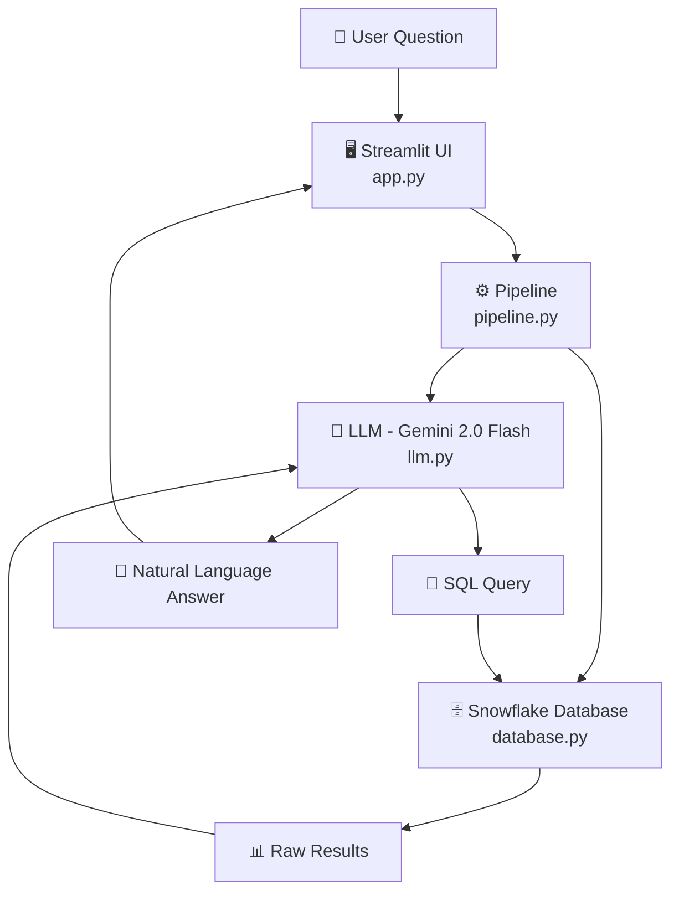
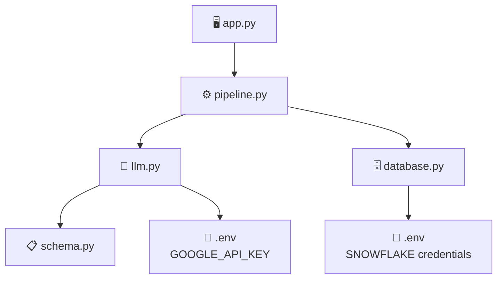

# 🤖 Text-to-SQL AI Assistant

Convert plain English questions into SQL queries and get instant answers
from your Snowflake database — powered by Google Gemini 2.0 Flash.


## 🌐 Live Demo
👉 [Click here to try the app](https://your-app-url.streamlit.app)

---

## 📌 What This Project Does

This app lets non-technical users query a Snowflake database using plain English.
No SQL knowledge required.

**Example questions you can ask:**
- *"Who are the top 3 highest paid employees?"*
- *"Which department has the highest total salary budget?"*
- *"List all employees hired after 2021 in London"*
- *"How many active employees work in Engineering?"*

The app translates your question into SQL, runs it on Snowflake, and returns
a clear natural language answer — all in seconds.

---

## 🏗️ Architecture



**Two-LLM-call pipeline:**
1. **LLM Call 1** — Gemini converts the user's question → SQL query
2. **Execute** — SQL runs on Snowflake and returns raw results
3. **LLM Call 2** — Gemini converts raw results → natural language answer

---

## 🗄️ Database Schema

The app queries a Snowflake HR database with 4 tables:

| Table | Description |
|---|---|
| `EMPLOYEES` | Employee records — name, salary, department, location |
| `DEPARTMENTS` | Department info — budget, manager, location |
| `PROJECTS` | Projects — status, budget, timeline |
| `EMPLOYEE_PROJECTS` | Junction table — employee-project assignments |

---

## ✨ Features

- 💬 **Conversational memory** — ask follow-up questions naturally
- 🔍 **SQL transparency** — view the generated SQL for every answer
- 📊 **Raw data view** — see the underlying query results as a table
- ⚡ **Fast responses** — Gemini 2.0 Flash for low latency
- 🛡️ **Error handling** — gracefully handles invalid or unanswerable questions

---

## 🛠️ Tech Stack

| Layer | Technology |
|---|---|
| Frontend | Streamlit |
| LLM | Google Gemini 2.0 Flash |
| Database | Snowflake |
| Language | Python 3.12 |
| LLM SDK | Google GenAI Python SDK |
| Config | python-dotenv |

---

## 🚀 Getting Started

### Prerequisites
- Python 3.12+
- Snowflake account with the HR schema set up
- Google AI Studio API key (free at [aistudio.google.com](https://aistudio.google.com))

### 1. Clone the repository
```bash
git clone https://github.com/your-username/text2sql-gemini.git
cd text2sql-gemini
```

### 2. Create a virtual environment
```bash
python -m venv .venv
source .venv/bin/activate  # Mac/Linux
.venv\Scripts\activate     # Windows
```

### 3. Install dependencies
```bash
pip install -r requirements.txt
```

### 4. Set up environment variables

Create a `.env` file in the root directory:
```env
GOOGLE_API_KEY=your_google_api_key_here
SNOWFLAKE_ACCOUNT=your_account_identifier
SNOWFLAKE_USER=your_username
SNOWFLAKE_PASSWORD=your_password
SNOWFLAKE_DATABASE=your_database
SNOWFLAKE_SCHEMA=your_schema
SNOWFLAKE_WAREHOUSE=your_warehouse
```

### 5. Set up the Snowflake database

Run the SQL setup script in your Snowflake worksheet:
```bash
# File: setup.sql
```
_(Creates EMPLOYEES, DEPARTMENTS, PROJECTS, EMPLOYEE_PROJECTS tables with sample data)_

### 6. Run the app
```bash
streamlit run app.py
```

Open [http://localhost:8501](http://localhost:8501) in your browser.

---

## 📁 Project Structure




## 🙋 How It Works — Step by Step

1. User types a question in plain English
2. `app.py` passes it to `pipeline.py` along with conversation history
3. `pipeline.py` calls `llm.py` → Gemini generates a SQL query
4. `pipeline.py` calls `database.py` → SQL executes on Snowflake
5. Raw results are passed back to `llm.py` → Gemini explains the results
6. The natural language answer is displayed in the chat UI
7. The conversation is saved in session state for follow-up questions


## 👩‍💻 Author

**Keerthi Vinukonda**
- LinkedIn: https://www.linkedin.com/in/keerthi-v-4022a8263/
- GitHub: https://github.com/keerthihp96
